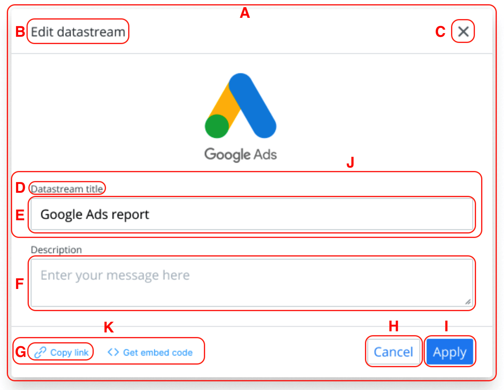
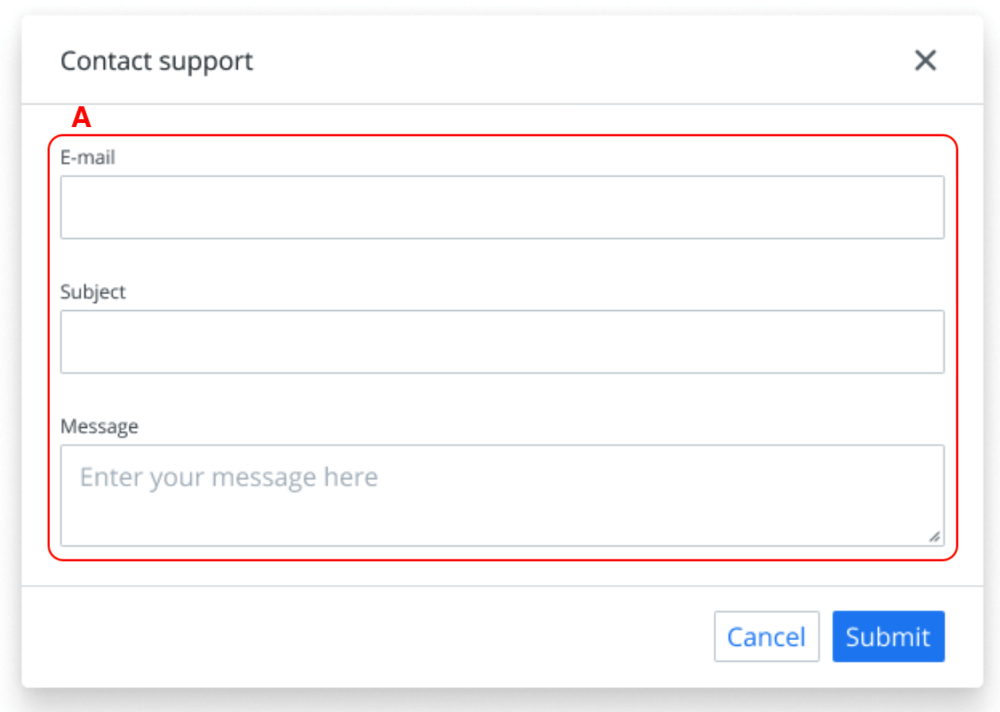
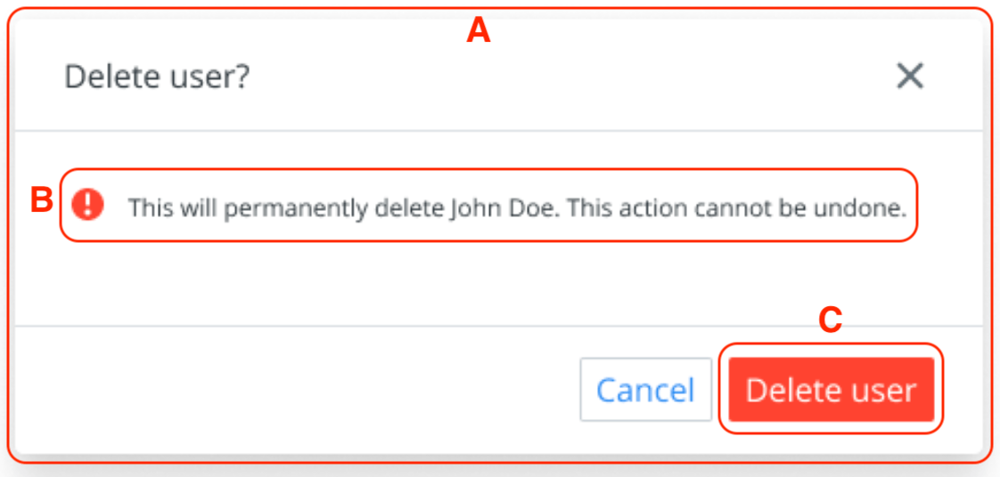
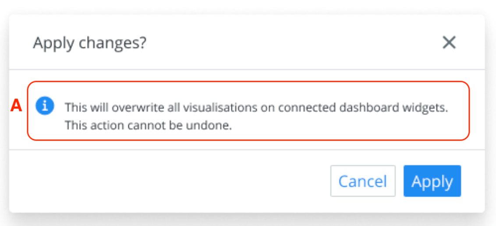

# Design System Principal Engineer Challenge Responses

Author: [Aaron Garcia Hervas](https://www.linkedin.com/in/aarongarciah) (aarongarciahervas@gmail.com)

Date: 2021-09-20

## API Design

#### Given provided mockups, how would you split them into components? Identify as many components as you can.



- A: `Dialog` (it would contain sub-components like `DialogHeader`, `DialogFooter`, etc.)
- B: `Heading`
- C: `CloseButton` (this component would be standalone if it would be reused in other components like `Drawer`, `Alert` or another dismissable components)
- D: `InputLabel`
- E: `InputText`
- F: `Textarea`
- G: `IconTextButton`
- H: `Button` (secondary variant)
- I: `Button` (primary variant)
- J: `FormControl`
- K: `Inline`



- A: `Stack` (or `FormLayout`, a specialized component built on top of `Stack` to lay out form controls)



- A: `AlertDialog` (built on top of `Dialog` with minimal changes but a more closed API)
- B: `Alert` (also known as `Banner`, error variant)
- C: `Button` (destructive variant)



- A: `Alert` (also known as `Banner`, info variant)

#### How would you design the props interface of the modal dialog component? Write an RFC (Request for Comments)

See _[rfc.md](rfc.md)_ file.

#### 1. How would you approach a request from a team asking for a dialog without the close button in the header?

Since the component has been designed as a compound component to be flexible enough and allow consumers to build custom abstractions on top of `Dialog` (as described in the [RFC](rfc.md)), the only thing needed to have a dialog without a close button is to not render `<Dialog.CloseButton />`.

A new section should be added to the docs explaining that if the `Dialog.CloseButton` is not included, a clear action should be added to close the dialog, e.g. a "Cancel" button in the dialog footer.

Example of dialog without close button:

```javascript
<Dialog>
  <Dialog.Header>
    <Dialog.Title>Title</Dialog.Title>
  </Dialog.Header>
  <Dialog.Content>Content</Dialog.Content>
  <Dialog.Footer>
    <Dialog.FooterActions>
      <Button variant="secondary" onClick={haandleClose}>
        Cancel
      </Button>
      <Button variant="primary">Apply</Button>
    </Dialog.FooterActions>
  </Dialog.Footer>
</Dialog>
```

#### 2. How would you make the header and footer of the dialog window optional?

Since the component has been designed as a compound component to be flexible enough and allow consumers to build custom abstractions on top of `Dialog` (as described in the [RFC](rfc.md)), the header and footer are already optional.

With that said, the docs should include sections describing how to handle these scenarios:

- Without header: always provide an accessible label to `Dialog` and an obvious action that will close the dialog.
- Without footer: always include `Dialog.CloseButton` to let users close the dialog in an obvious way since clicking the overlay or pressing <kbd>ESC</kbd> is not obvious to all users.

Example of dialog without header:

```javascript
<Dialog aria-label="Title">
  <Dialog.Content>Content</Dialog.Content>
  <Dialog.Footer>
    <Dialog.FooterActions>
      <Button variant="secondary" onClick={haandleClose}>
        Cancel
      </Button>
      <Button variant="primary">Apply</Button>
    </Dialog.FooterActions>
  </Dialog.Footer>
</Dialog>
```

Example of dialog without footer:

```javascript
<Dialog>
  <Dialog.Header>
    <Dialog.Title>Title</Dialog.Title>
    <Dialog.CloseButton />
  </Dialog.Header>
  <Dialog.Content>Content</Dialog.Content>
</Dialog>
```

## Component implementation

Dive into the _[src](../src)_ folder to see the source code.

#### 1. Write down a strategy of how would you introduce a breaking change to a component after it’s released.

- Have a roadmap for the component with a plan that details changes in the upcoming versions. If possible, the roadmap should be public and be present in a section of the docs. The roadmap should detail future releases and the expected breaking and non-breaking changes.
- Before releasing a major version containing the breaking change, prepare consumers for an easy as possible migration in a prior release by adding warnings pointing out that in a future release the prop or component will be deprecated.
- If some props or components are being deprecated, mark them as deprecated using `@deprecated` JSDoc comments and if possible recommend consumers to use [some ESLint rule](https://github.com/gund/eslint-plugin-deprecation) to warn them against their usage.
- After releasing a breaking change, try to keep the old API in parallel until a future version and show warnings when consumers are using a deprecated API.

#### 2. How would you test the component?

I see two types of tests needed to be confident that this component will work as expected after introducing changes to it (or some of its dependencies) in the future:

- **Behavioural tests:** to make sure our component behaves as expected.
- **Visual tests:** to make sure our component looks as expected.

First, let's talk about behavioural tests. I'd write these tests using [React Testing Library](https://testing-library.com/docs/react-testing-library/intro/) and interacting with the component in the same way a user would interact with it. Special mention to the [`user-event`](https://github.com/testing-library/user-event) which let's us to better simulate user interactions. RTL also helps developers to avoid testing implementation details and focus on accessibility. Although Jest or other tests runners use [jsdom](https://github.com/jsdom/jsdom) to simulate a browser, I think it's a good tradeoff in exchange of fast running tests and it gives us a good amount of confidence that our component is working as expected.

Another option I like but I haven't been able to play with is [Cypress Component Testing](https://docs.cypress.io/guides/component-testing/introduction), which let's us test components in isolation in a real browser. Running tests in a real browser brings the benefit of having the ability to debug components with browser dev tools. The awesome [Cypress Testing Library](https://testing-library.com/docs/cypress-testing-library/intro) could be used to make it easier to write tests that focus on accessibility. Cypress Component Testing is in Alpha at the time of writing so that also needs to be considered. Using this approach would require to be sure that tests run fast enough compared to the jsdom counterpart.

Some examples of meaningful interactions that should be tested with either React Testing Library or Cypress Component Testing.:

- The dialog closes when clicking the close button.
- The dialog closes when clicking the overlay.
- The dialog closes when clicking the cancel button.
- The dialog has the correct aria roles.
- The dialog is properly labelled.

> ℹ️ You can see some tests written in this very project following this approach. Go to [src/components/Dialog/Dialog.test.ts](../src/components/Dialog/Dialog.test.tsx) to see them.

Now let's talk about visual tests. We write these tests to be sure that the appearance of our components doesn't change unintentionally. Giving for granted that we are using Storybook, my favourite tool for visual tests is [Chromatic](https://www.chromatic.com/) from the maintainers of Storybook. Chromatic is:

- Cloud based.
- Easy to configure.
- Easy to integrate with GitHub, Gitlab and such tools.
- People outside the engineering team (e.g. people without a GitHub account in an organization that uses GitHub) like product managers, designers, etc. can be easily involved in the review process since they can be added to Chromatic.

My favourite way of integrating Chromatic in the dev workflow is to add a visual test step in pull requests pipelines. This means that if some UI changes, Chromatic will notify our CI about something failing and the pull request can't be merged until the visual changes are approved in Chromatic.

Maybe adding a dependency to an external system in the cloud or adding a new paid tool is not aligned with the team's needs, so as an alternative we could use a self-hosted tool like [BackstopJS](https://github.com/garris/BackstopJS), which also works great, but doesn't have all the collaborative elements that Chromatic provides.

> ℹ️ Chromatic has been set up in this project. Here's [an example PR](https://github.com/aarongarciah/modal-challenge/pull/1) with Chromatic running CI checks (you'll need GitHub permissions in the repository, ask [Andrey](andrey@okonet.ru) for permissions).
>
> You can also see the [latest Storybook version live](https://www.chromatic.com/library?appId=614deddacfee49004a1304c7).

#### 3. How would you teach developers to use it?

Developers with basic React knowledge should be able to use the component by reading its docs and reading or copy/pasting some code snippets.

If a component requires more than docs to be used there's a chance the component API can be simplified further or the component encapsulates some logic that is difficult per se and the problem is not the component API but the encapsulated logic that needs to be known by the developer, e.g. a component encapsulating some complex ThreeJS logic that requires the developer to know about ThreeJS.

Although is not directly related to the question, improving discoverability of new components, bug fixes or breaking changes, is a job for the DS team. The DS team can use several channels when a new release of the library is published:

- GitHub releases (or any other platform) so devs subscribed to the repo are notified.
- Automatic Slack message linking the GitHub release.
- Hand written Slack message by the DS team detailing the new component.
- An email written by the DS team detailing the new release.
