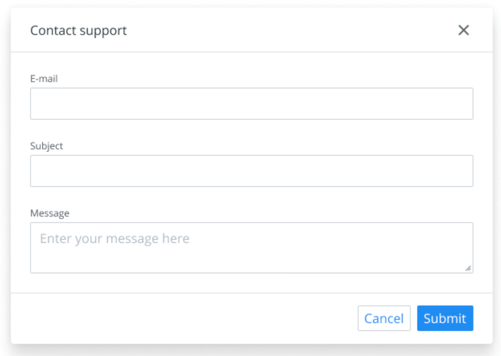

- Start Date: 2021-09-17
- RFC PR: TBD

# Summary



A new `Dialog` (modal) component to show a piece of UI above everything else in the page. The `Dialog` component follows the [WAI-ARIA design pattern](https://www.w3.org/TR/wai-aria-practices-1.2/#dialog_modal) to be fully accessible and to feel as familiar as possible with other dialog implementations around the web.

> Note: this RFC doesn't cover non-modal dialogs, only modal dialogs.

# Basic example

Here's a basic example on how the `Dialog` component would be used.

```javascript
<Dialog open={true} onClose={handleClose}>
  <Dialog.Header>
    <Dialog.Title>Title</Dialog.Title>
    <Dialog.CloseButton />
  </Dialog.Header>
  <Dialog.Content>Content</Dialog.Content>
  <Dialog.Footer>
    <Dialog.Actions>
      <Button variant="secondary" onClick={handleClose}>
        Cancel
      </Button>
      <Button variant="primary" onClick={handleApply}>
        Apply
      </Button>
    </Dialog.Actions>
  </Dialog.Footer>
</Dialog>
```

# Motivation

We want to show information to users preventing them from interacting with the rest of the page in these scenarios:

- We want to capture users data without having them leave the page.
- We want to show additional information to the user without losing context of the current page.
- We want users to focus solely in a specific piece of information without losing context of the current page.

# Detailed design

The `Dialog` component implements the modal dialog [WAI-ARIA design pattern](https://www.w3.org/TR/wai-aria-practices-1.2/#dialog_modal) to be fully accessible. This is the north star for every decision made to design this component.

## Usage

A dialog with all of the possible pieces looks like this:

```javascript
import { Dialog } from '@team-ds/react';

<Dialog open={open} onClose={handleClose}>
  <Dialog.Header>
    <Dialog.Title>Apply changes?</Dialog.Title>
    <Dialog.CloseButton />
  </Dialog.Header>
  <Dialog.Content>
    <p>This will overwrite your previous changes.</p>
  </Dialog.Content>
  <Dialog.Footer>
    <Dialog.Actions>
      <Button variant="secondary">Cancel</Button>
      <Button variant="primary">Apply</Button>
    </Dialog.Actions>
  </Dialog.Footer>
</Dialog>;
```

- The visibility of the dialog is controlled via the `open` prop.
- The `onClose` prop accepts a callback that will be called whenever a user clicks the close button or clicks the overlay.
- Consumers can obviate rendering any element at their own risk, but several practical examples for different use cases will be available in the docs.
- `Dialog.Overlay` is intentionally not exposed as a sub-component because we want it to be always present.

For a full list of props see the full [API](#api).

## Accessibility

`Dialog` follows the [modal dialog WAI-ARIA design pattern](https://www.w3.org/TR/wai-aria-practices-1.2/#dialog_modal) so it implements the corresponding keyboard and focus interactions and adds the corresponding ARIA roles and attributes.

### Keyboard and Focus Management

- The focus is trapped within the dialog, meaning the the rest of the page will not be focusable until the dialog is closed. This will be accomplished using the [`react-focus-lock`](https://github.com/theKashey/react-focus-lock) package.
- When the dialog is opened, the first focusable element will be focused unless `initialFocusRef` is passed. If no tabbable element is found, `Dialog.Content` will receive focus.
- When the dialog is closed, the element that triggered the opening of the dialog will be focused unless `finalFocusRef` is passed.
- A click on the overlay fires the `onClose` callback.
- Pressing <kbd>ESC</kbd> fires the `onClose` callback.
- Scroll is blocked outside the dialog.
- The dialog is rendered in a [React portal](https://reactjs.org/docs/portals.html) at the end of the `<body>` to escape the source order and make it easy to add `aria-hidden` to the rest of the page content.

### ARIA

- `Dialog.Content` has `role="dialog"` and `aria-modal="true"`.
- `Dialog` has `aria-labelledby` set to the id in `Dialog.Header`. This unique id will be auto-generated so consumers don't need to manually add the `id` and `aria-labelledby` attributes. These attributes can be overwritten.

Optionally, consumers will be able to add `aria-describedby` to `Dialog` pointing to some element id inside the dialog to add further context for assistive tech.

## Design considerations

- An overlay covers the whole page and it's rendered below the dialog. The overlay will cover the whole content underneath the dialog but it will have some opacity to see the content underneath.
- The dialog window will have a maximum width.
- The dialog window will have two possible maximum widths: default and large.
- The dialog will never exceed the width or height of the viewport.
- The dialog will always have some space between the dialog window and the viewport.
- If the contents of the dialog exceeds its width or height, a scrollbar should appear in `Dialog.Content` enabling users to inspect all of the contents but leaving `Dialog.Header` and `Dialog.Footer` always visible outside of the scrollable area.
- The dialog window will always be horizontally and vertically centered in the viewport.

> Check the corresponding design files to get the actual colors and sizes.

## Implementation

### Dependencies

The whole implementation of the component will be made from scratch, except the focus trap which will be build using the [`react-focus-lock`](https://github.com/theKashey/react-focus-lock) package. No other external libraries will be added.

### Sharing data between compound components

Since this is a compound component, we'll use React context to pass data and props from the top level component (`Dialog`) to the sub-components. For example, the value of this context (which will be an object) will contain the `onClose` callback that it's passed as a prop to `Dialog` so it may be called from `Dialog.CloseButton`.

### Accessibility

To make things easier for consumers and don't require accessibility knowledge to use this component, a random id will be generated and it will be set in `Dialog` `aria-labelledby` and `Dialog.Title` `id` attributes. The value of this id will be shared with a React context.

If `Dialog.Title` is not present and `aria-label` or `aria-labelledby` are not passed to `Dialog`, we should warn in development mode against this to encourage always having an accessible label on `Dialog` for now.

### Structure

We won't check if consumers don't end up with the correct component structure inside `Dialog` (e.g. putting `Dialog.Actions` outside of `Dialog.Footer`) or if they're using sub-components outside `Dialog`. This can be added in the future by getting the context from every sub-component and checking if the context has a value.

## Examples

We want consumers of this component to be able to move fast and have the flexibility to build patterns on top of this component without the need of modifying the existing implementation. That's why a [compound component](https://www.smashingmagazine.com/2021/08/compound-components-react) approach has been chosen to find a good balance between flexibility, accessibility and design constraints. With this approach, we can easily create different dialogs to serve different needs but at the same time the dialog remains true to its design:

- Without close button in the header

  ```javascript
  <Dialog>
    <Dialog.Header>
      <Dialog.Title>Apply changes?</Dialog.Title>
    </Dialog.Header>
    <Dialog.Content>
      <p>This will overwrite your previous changes.</p>
    </Dialog.Content>
    <Dialog.Footer>
      <Dialog.Actions>
        <Button variant="secondary">Cancel</Button>
        <Button variant="primary">Apply</Button>
      </Dialog.Actions>
    </Dialog.Footer>
  </Dialog>
  ```

- Without header, but being able to provide an accessible label

  ```javascript
  <Dialog aria-label="Apply changes?">
    <Dialog.Content>
      <p>This will overwrite your previous changes.</p>
    </Dialog.Content>
    <Dialog.Footer>
      <Dialog.Actions>
        <Button variant="secondary">Cancel</Button>
        <Button variant="primary">Apply</Button>
      </Dialog.Actions>
    </Dialog.Footer>
  </Dialog>
  ```

- Without custom title HTML tag

  ```javascript
  <Dialog>
    <Dialog.Header>
      <Dialog.Title as="h1">Apply changes?</Dialog.Title>
      <Dialog.CloseButton />
    </Dialog.Header>
    <Dialog.Content>
      <p>This will overwrite your previous changes.</p>
    </Dialog.Content>
    <Dialog.Footer>
      <Dialog.Actions>
        <Button variant="secondary">Cancel</Button>
        <Button variant="primary">Apply</Button>
      </Dialog.Actions>
    </Dialog.Footer>
  </Dialog>
  ```

- Without footer

  ```javascript
  <Dialog>
    <Dialog.Header>
      <Dialog.Title>Alert</Dialog.Title>
      <Dialog.CloseButton />
    </Dialog.Header>
    <Dialog.Content>
      This message is merely informative and doesn't require user action, it can be dismissed via
      the close button.
    </Dialog.Content>
  </Dialog>
  ```

- With custom footer

  ```javascript
  <Dialog>
    <Dialog.Header>
      <Dialog.Title>Edit datastream</Dialog.Title>
      <Dialog.CloseButton />
    </Dialog.Header>
    <Dialog.Content>
      <p>This will overwrite your previous changes.</p>
    </Dialog.Content>
    <Dialog.Footer>
      <Box css={{ display: 'flex', flexWrap: 'wrap', justifyContent: 'space-between' }}>
        <Box css={{ display: 'flex', flexWrap: 'wrap', gap: 16 }}>
          <IconTextButton>Copy link</IconTextButton>
          <IconTextButton>Get embed code</IconTextButton>
        </Box>
        <Dialog.Actions>
          <Button variant="secondary">Cancel</Button>
          <Button variant="primary">Apply</Button>
        </Dialog.Actions>
      </Box>
    </Dialog.Footer>
  </Dialog>
  ```

- Making the primary action button of the dialog act as a submit button by making the whole dialog a form

  ```javascript
  <Dialog as="form" acceptCharset="utf-8" action="#" method="post" onSubmit={handleSubmit}>
    <Dialog.Header>
      <Dialog.Title>Contact support</Dialog.Title>
      <Dialog.CloseButton />
    </Dialog.Header>
    <Dialog.Content>
      <label>
        Name
        <input name="name" type="text" required />
      </label>
      <label>
        Describe your problem
        <textarea name="description" required />
      </label>
    </Dialog.Content>
    <Dialog.Footer>
      <Dialog.Actions>
        <Button variant="secondary">Cancel</Button>
        <Button variant="primary" type="submit">
          Send
        </Button>
      </Dialog.Actions>
    </Dialog.Footer>
  </Dialog>
  ```

- Making the primary action button of the dialog the submit button of the form contained in the dialog by associating the button with the form via the [`form` attribute](https://developer.mozilla.org/en-US/docs/Web/HTML/Element/button#attr-form)

  ```javascript
  <Dialog>
    <Dialog.Header>
      <Dialog.Title>Contact support</Dialog.Title>
      <Dialog.CloseButton />
    </Dialog.Header>
    <Dialog.Content>
      <form id="contact-form" acceptCharset="utf-8" action="#" onSubmit={handleSubmit}>
        <label>
          Name
          <input name="name" type="text" required />
        </label>
        <label>
          Describe your problem
          <textarea name="description" required />
        </label>
      </form>
    </Dialog.Content>
    <Dialog.Footer>
      <Dialog.Actions>
        <Button variant="secondary">Cancel</Button>
        <Button variant="primary" type="submit" form="contact-form">
          Send
        </Button>
      </Dialog.Actions>
    </Dialog.Footer>
  </Dialog>
  ```

## Custom abstractions

With this approach we also let consumers to easily create wrappers on top of `Dialog`. For example:

```javascript
const GenericErrorDialog = ({ error, open, onClose, title, ...rest }) => {
  return (
    <Dialog open={open} onClose={onClose} {...rest}>
      <Dialog.Header>
        <Dialog.Title>{title || 'An error has occurred'}</Dialog.Title>
        <Dialog.CloseButton />
      </Dialog.Header>
      <Dialog.Content>
        <Alert variant="error">{error.message}</Alert>
      </Dialog.Content>
      <Dialog.Footer>
        <Dialog.Actions>
          <Button variant="secondary" onClick={onClose}>
            Dismiss
          </Button>
        </Dialog.Actions>
      </Dialog.Footer>
    </Dialog>
  );
};
```

At a design system level we also are able to introduce new components built on top of `Dialog`, for example an `AlertDialog`. The alert dialog [WAI-ARIA pattern](https://www.w3.org/TR/wai-aria-practices-1.2/#alertdialog) is very similar to the modal dialog one, with some differences:

- The container must have a `role="alertdialog"` instead of `role="dialog"`.
- An alert dialog typically must always have some kind of action attached to it:
  - In case of an alert, something button to dismiss the alert ("ok", "dismiss", etc.)
  - In case of a confirmation, one action to dismiss cancel the operation ("cancel") and one action to confirm ("apply").

A very simplified implementation could look like:

```javascript
const AlertDialog = ({
  children,
  open,
  title,
  cancelLabel,
  confirmLabel,
  onClose,
  onConfirm,
  ...rest
}) => {
  return (
    <Dialog open={open} onClose={onClose} role="alertdialog" {...rest}>
      <Dialog.Header>
        {title && <Dialog.Title>{title}</Dialog.Title>}
        <Dialog.CloseButton />
      </Dialog.Header>
      <Dialog.Content>{children}</Dialog.Content>
      <Dialog.Footer>
        <Dialog.Actions>
          {cancelLabel && (
            <Button variant="secondary" onClick={onClose}>
              {cancelLabel}
            </Button>
          )}
          {confirmLabel && (
            <Button variant="primary" onClick={onConfirm}>
              {confirmLabel}
            </Button>
          )}
        </Dialog.Actions>
      </Dialog.Footer>
    </Dialog>
  );
};

// Usage
<AlertDialog
  open={true}
  title="Apply changes?"
  cancelLabel="Cancel"
  confirmLabel="Apply"
  onClose={handleClose}
  onConfirm={handleConfirm}
>
  <p>This will overwrite your previous changes.</p>
</AlertDialog>;
```

## API

### `Dialog`

| prop                  | type                                | default value | description                                                                                                                                                                                                         |
| --------------------- | ----------------------------------- | ------------- | ------------------------------------------------------------------------------------------------------------------------------------------------------------------------------------------------------------------- |
| `aria-label`          | `string`                            | —             | Pass a label when `Dialog.Title` is not present or `aria-labelledby` is not passed.                                                                                                                                 |
| `aria-labelledby`     | `string`                            | random id     | By default a random id is set to `aria-labelledby` and that same id is set to `Dialog.Title`'s `id` attribute. Overwrite it if you need to label the dialog with another element and `Dialog.Title` is not present. |
| `children`            | `React.ReactNode`                   | —             | Pass `Dialog.Header`, `Dialog.Content` and `Dialog.Footer` here.                                                                                                                                                    |
| `closeOnOverlayClick` | `boolean`                           | `true`        | If `true`, when the overlay is clicked the `onClose` callback will be called.                                                                                                                                       |
| `finalFocusRef`       | `React.RefObject<FocusableElement>` | —             | If present, once the dialog is closed the focus will be moved to this element. This is useful when the element triggering the dialog goes away when the dialog is opened.                                           |
| `initialFocusRef`     | `React.RefObject<FocusableElement>` | —             | If present, once the dialog is opened the focus will be moved to this element.                                                                                                                                      |
| `onClose`             | `() => void`                        | —             | Callback invoked when the dialog is closed.                                                                                                                                                                         |
| `open`                | `boolean`                           | —             | If `true`, the dialog will be open.                                                                                                                                                                                 |
| `size`                | `"regular" \| "large"`              | `"regular"`   | Defines the size (max width) of the dialog.                                                                                                                                                                         |

### `Dialog.Header`

| prop       | type              | default value | description               |
| ---------- | ----------------- | ------------- | ------------------------- |
| `children` | `React.ReactNode` | —             | Pass `Dialog.Title` here. |

### `Dialog.Title`

| prop       | type                 | default value | description                                                                                         |
| ---------- | -------------------- | ------------- | --------------------------------------------------------------------------------------------------- |
| `as`       | `React.ReactElement` | `"h3"`        | The element to be rendered. The rendered DOM element should be a heading tag (`"h1"`, `"h2"`, ...). |
| `children` | `React.ReactNode`    | —             |                                                                                                     |

### `Dialog.CloseButton`

| prop         | type     | default value | description      |
| ------------ | -------- | ------------- | ---------------- |
| `aria-label` | `string` | `"Close"`     | Accessible label |

### `Dialog.Content`

| prop       | type                 | default value | description                               |
| ---------- | -------------------- | ------------- | ----------------------------------------- |
| `as`       | `React.ReactElement` | `"div"`       | The element to be rendered.               |
| `children` | `React.ReactNode`    | —             | Pass the main content of the dialog here. |

### `Dialog.Footer`

| prop       | type              | default value | description                 |
| ---------- | ----------------- | ------------- | --------------------------- |
| `children` | `React.ReactNode` | —             | Pass `Dialog.Actions` here. |

### `Dialog.Actions`

| prop       | type              | default value | description                                                      |
| ---------- | ----------------- | ------------- | ---------------------------------------------------------------- |
| `children` | `React.ReactNode` | —             | In almost all cases only `Button`s should be passed as children. |

# Drawbacks

Using a compound component approach means:

- We are aligned with the rest of the components in the design system.
- We leave up to the consumer the responsibility of rendering correctly the component. We could add checks and warnings to verify that the consumer is putting the sub-components in the right spot, but that comes with an implementation and maintainability cost.
- Consumers can overwrite and break the accessibility of the component because sub-components accept props like `className`, `role`, `style`, etc.

We could use a more closed API like:

```javascript
<Dialog
  open={true}
  title="Apply changes?"
  onClose={handleClose}
  actions={[
    <Button variant="secondary">Cancel</Button>,
    <Button variant="primary" onClick={handleClose}>
      Send
    </Button>,
  ]}
>
  <p>This will overwrite your previous changes.</p>
</Dialog>
```

Which would mean:

- Design, structure and accessibility can be easily constrained.
- Type safety.
- Consumers can't easily create abstractions on top (e.g. a dialog without the close button)
- Consumers can't introduce modifications like a custom footer, custom header, non-padded content etc.

Since the whole design system is built with the idea of give enough flexibility to the consumers, even with caveats, a compound component approach seems a good choice.

# Alternatives

We could use proven libraries like [Radix Primitives](https://www.radix-ui.com/docs/primitives/components/dialog) (component based) or [React Aria](https://react-spectrum.adobe.com/react-aria/useDialog.html) (hooks based), but:

- That would remove lots of hours of development and maintenance.
- Introduces external dependencies which also can fail.
- It would go against the approach of using the minimum number of dependencies followed in the rest of the design system.

Another element of discussion is

# Adoption strategy

Since this is a new component, code wise the adoption strategy is straightforward. There's nothing to change or migrate. Regarding adoption from a UX point of view, we need to educate consumers on how to properly use this pattern. See [How we teach this](#how-we-teach-this) for more info.

# How we teach this

Code wise, the `Dialog` component docs should be enough for all developers to know how to use the component. If users are in the correct library version, copy/pasting a snippet of code from the `Dialog` component docs is all they need to start playing with this component. This is a really common component and pattern, present in most component libraries and design systems in the wild so we don't expect problems with consumers learning how to use it.

UX wise, the component's docs should have a section with do/don't examples detailing when to use this component and when to use another component/pattern to solve the problem. Also, some guidelines around how to write dialog's titles and button copys would be really helpful. Twilio's Paste design system [has a great example](https://paste.twilio.design/components/modal/#when-to-use-modal).

Accessibility wise, this component tries to include everything to make it fully accessible by default. Docs should describe what accessibility behaviour the component includes and what it's expected in case the consumer tries to build something on top of `Dialog`. For example, a consumer needs to modify the `id` attribute on `Dialog.Title`, then they need to make sure the `aria-labelledby` in `Dialog` is pointing to an existing text node or `Dialog` has an `aria-label` attribute.
